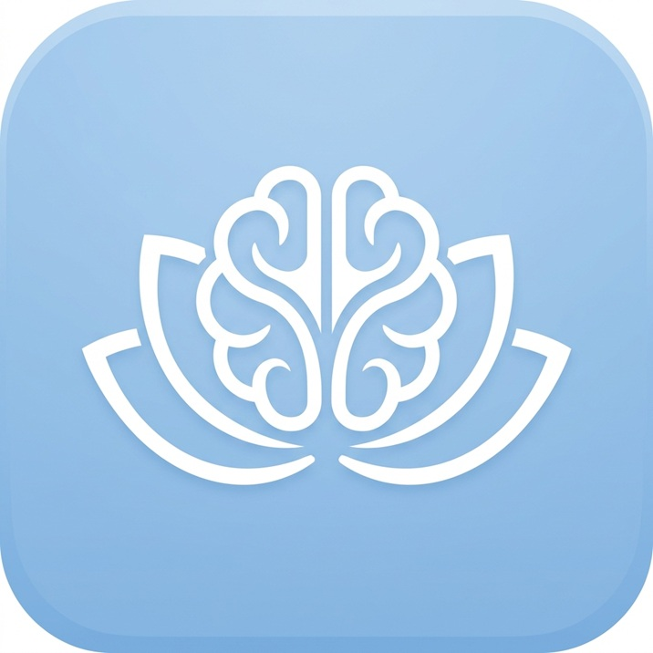

<p align="center">
  
</p>

<h1 align="center">PeaceMind AI</h1>

<p align="center">
  <strong>A Production-Hardened, CBT-Informed Mental Wellness Companion</strong><br/>
  Secure, private, and evidence-based Cognitive Behavioral Therapy support — right in your browser.
</p>

<p align="center">
  
  
  
  
  
</p>

---

## 📖 About

**PeaceMind AI** is a Progressive Web App (PWA) that serves as a CBT-informed mental wellness companion. Powered by Google's Gemini 2.5 Flash, it helps users identify cognitive distortions, challenge unhelpful thinking patterns, and build healthier mental habits through structured, evidence-based conversations.

This version has been **refactored for production**, featuring enterprise-grade security, improved stability, and a polished user experience.

> ⚠️ **Disclaimer:** PeaceMind AI is a peer-support tool, **not** a replacement for professional mental health care. It cannot provide diagnoses, prescriptions, or medical treatment. If you are in crisis, please contact emergency services or a licensed mental health professional.

---

## ✨ Key Improvements (v2.0)

### 🔒 Enterprise-Grade Security
- **XSS Protection:** Eliminated `innerHTML` usage. All rendering uses safe DOM node creation to prevent cross-site scripting.
- **API Hardening:** Locked down CORS, implemented **Rate Limiting** (30 req/15min), and added **Helmet** security headers.
- **Data Privacy:** Rolling history limits ensure your `localStorage` never grows indefinitely (100 messages max). No data is stored on the server.

### 🚀 Performance & Stability
- **Robust Caching:** Refactored Service Worker handles CDN failures gracefully and provides a native-like offline fallback.
- **Reliable AI Handling:** Centralized API client with request timeouts (30s) and automatic retry options for failed connections.
- **Input Validation:** Server-side validation for oversized payloads and sanitized client-side inputs.

### 🎨 Polished UX
- **Dynamic Animations:** Smooth fade transitions for modals and a calm, animated "typing" indicator.
- **Accessibility:** Restored native browser zoom and improved mobile touch targets for better inclusivity.
- **Responsive Design:** Optimized for mobile, tablet, and desktop with a focus on CBT-oriented calm aesthetics.

---

## 🏗️ Architecture

```
peacemind-ai-cbt/
├── index.html              # Hardened app shell (SPA)
├── style.css               # Modernized stylesheet with transitions
├── manifest.json           # PWA manifest
├── sw.js                   # Robust Service Worker (v2)
├── js/
│   ├── ai.js               # Centralized API client with timeout & retry
│   ├── app.js              # Safe rendering controller (XSS protected)
│   ├── safety.js           # Crisis detection engine
│   └── storage.js          # localStorage with rolling history limits
└── server/
    ├── server.js           # Hardened Express backend (Proxy)
    ├── .env.example        # Environment template
    └── package.json        # Dependencies (Helmet, Rate-Limit, etc.)
```

---

## 🚀 Getting Started

### Prerequisites
- [Node.js](https://nodejs.org/) (v18+)
- A [Google Gemini API Key](https://aistudio.google.com/apikey)

### 1. Installation
```bash
git clone https://github.com/Muneeb11221/peacemind-ai-cbt.git
cd peacemind-ai-cbt/server
npm install
```

### 2. Configuration
Create a `.env` file in the `server/` directory:
```bash
GEMINI_API_KEY=your_actual_api_key_here
PORT=3000
FRONTEND_URL=http://localhost:8080
```

### 3. Execution
```bash
# Start the backend
npm start

# Open the frontend (any local server works)
# Example using Python:
cd ..
python -m http.server 8080
```
Navigate to `http://localhost:8080` in your browser.

---

## ⚙️ Environment Variables

| Variable | Required | Description |
|:---|:---:|:---|
| `GEMINI_API_KEY` | ✅ | Your Google AI Studio API Key |
| `PORT` | ❌ | Backend port (default: 3000) |
| `FRONTEND_URL` | ❌ | Frontend origin for CORS lockdown |
| `NODE_ENV` | ❌ | Set to `production` for strict security defaults |

---

## 🧠 CBT System Design

PeaceMind follows a three-phase therapeutic structure:
1. **Understanding:** Deep-diving into situations and emotional reactions.
2. **Identification:** Highlighting cognitive distortions (e.g., Mind Reading, Catastrophizing).
3. **Intervention:** Practical reframing and behavioral experiments.

### Safety Protocols
The app uses **Dual-Layer Protection**:
- **Client-Side:** `safety.js` scans messages instantly for high-risk keywords.
- **Server-Side:** The system prompt instructs the AI to prioritize safety over CBT analysis when risk is detected.

---

## 📄 License
Project available under the [MIT License](LICENSE).

---

<p align="center">
  Made with ❤️ for mental wellness by <strong>Muneeb</strong>
</p>
